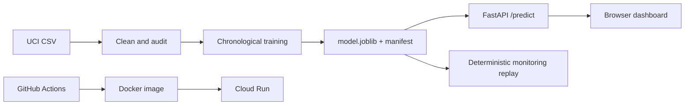

# ParkPulse

ParkPulse is a local, teachable FastAPI application for moving a small parking occupancy model from development to production. It includes exact target matching, chronological evaluation, a persistence baseline, bounded predictions, replay-based monitoring, Docker, and Cloud Run preparation.

## Run locally

Windows PowerShell:

```powershell
py -3.11 -m venv .venv
.venv\Scripts\Activate.ps1
python -m pip install -e ".[dev]"
python scripts\train.py
cd frontend
npm ci
npm run build
cd ..
python run.py
```

bash:

```bash
python3.11 -m venv .venv
source .venv/bin/activate
python -m pip install -e '.[dev]'
python scripts/train.py
cd frontend
npm ci
npm run build
cd ..
python run.py
```

Open `http://localhost:8000`. The app does not download data or train at startup. To use another local CSV, run `python scripts/download_data.py --local-csv path/to/file.csv`; the official archive URL and checksum are printed. Health is at `/health`; API docs are at `/docs`.

For frontend-only development, run `cd frontend`, `npm install`, `npm run dev`, then open the Vite URL. The Vite proxy forwards `/api` to FastAPI on port 8000. The production Docker image builds the React bundle and serves it through FastAPI.

## Training and model versions

The reproducible CLI trains the default artifact with `python scripts/train.py`. To create a separate immutable version, use `python scripts/train.py --version real-2016-02`; the artifact is written under `artifacts/versions/real-2016-02/`. The UI Model ops view calls `POST /api/models/train`, but that route is disabled by default. Enable it only for local work with `PARKPULSE_ENABLE_TRAINING=1`. It rejects duplicate version names, writes a manifest and model file, and promotes the new version through `artifacts/current.json`. Cloud deployments should train in CI, validate the manifest, tag the image with the commit SHA, and promote through Cloud Run revisions.

## Checks

```bash
pytest -q
ruff check .
```

The CI workflow also builds a test image and calls `/health`. A release must be trained from the recorded real dataset; fixture or `test_only` artifacts must not be published. Run `npm ci --prefix frontend && npm run build --prefix frontend` to validate the React bundle separately.

## Architecture



Cloud Run preparation is intentionally not executed. Configure Artifact Registry, Cloud Run, APIs, and GitHub OIDC Workload Identity Federation, then set workflow variables `GCP_PROJECT_ID`, `GAR_LOCATION`, `GAR_REPOSITORY`, and `CLOUD_RUN_SERVICE` plus the two OIDC secrets. Build and deploy use the commit SHA as the image tag. Roll back with `gcloud run services update-traffic SERVICE --to-revisions=REVISION=100 --region=REGION`; delete the service and repository after the interview if no longer needed. Cloud Run local files and process memory are ephemeral, so replay JSON is not a durable monitoring store.

## Microteach plan

**0–2:** Introduce “how many occupied and available spaces in 30 minutes?” and objectives: production packaging, CI/CD, drift. Ask: *If the input distribution changes, must the model’s predictions become less accurate?* (No; measure performance after labels arrive.)

**2–5:** Contrast notebook training with a trusted versioned artifact, manifest, API validation, and historical data limits.

**5–8:** Show `Pipeline`, chronological boundaries, exact timestamp matching, bounds, Docker, `/health`, and `/predict`.

**8–11:** Show the pull-request CI gate and manual OIDC deployment. Explain commit-SHA image tags and rollback.

**11–15 live demo:** Open Prediction, choose a real historical example, show the 30-minute response and model version. Open Monitoring, run baseline replay, then controlled higher-occupancy data drift and fixed-input concept drift. Download or copy the JSON report.

**15–18:** Explain delayed labels: errors are unavailable until the target observation time. Data drift is not concept drift; performance deterioration alone does not prove concept drift. Ask: *What would you investigate before retraining?* (Data quality, cohort, label delay, seasonality, input pipeline, and baseline.)

**18–20:** Recap artifact, gate, monitor, investigate. Learner check: identify which input is known at prediction time and why persistence is a necessary baseline.

Fallback: run `python scripts/train.py` and use the JSON returned by `/api/replay/baseline`; the documented metrics are prepared real-data results, while any screenshot or saved report should be labelled as prepared historical output, not live monitoring.
